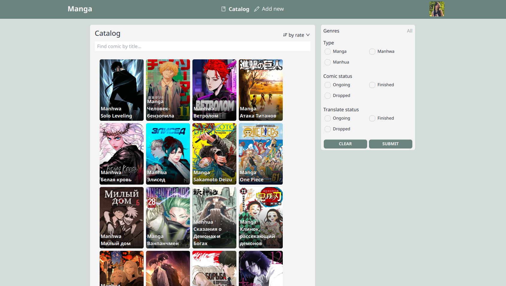
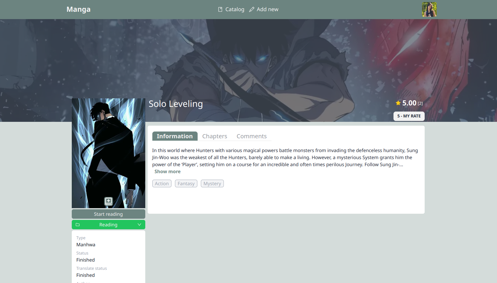
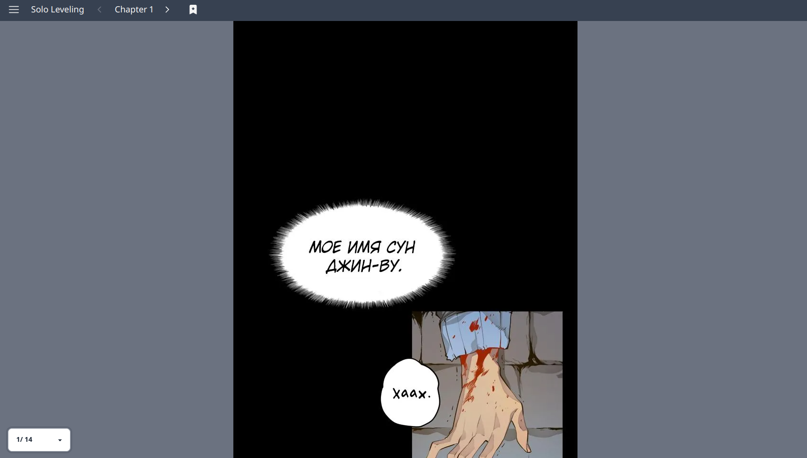

### Project Overview

This project represents my inaugural foray into full-stack development. For the backend, I employed NestJS, a versatile framework. Through this endeavor, I gained proficiency in several areas, including JWT token-based authorization, the art of file uploads and storage, and the implementation of CRUD operations. My backend is complemented by MongoDB, residing within a Docker container.

On the frontend, I harnessed the power of React with Vite and utilized useSWR for efficient data fetching. The app offers an array of features for users. You can register and log in, peruse manga content, upload your own manga creations, provide ratings for comics, and engage in discussions through comments on chapters or comics.

The homepage showcases the latest uploads and popular manga selections, providing an engaging and dynamic user experience.

#### Technologies Used

- Nestjs
- Mongodb
- Typescript
- Vite
- Framer-motion
- TailwindCSS
- useSWR
- Redux

[Explore the Source Code](https://github.com/iufb/shop.ing)
