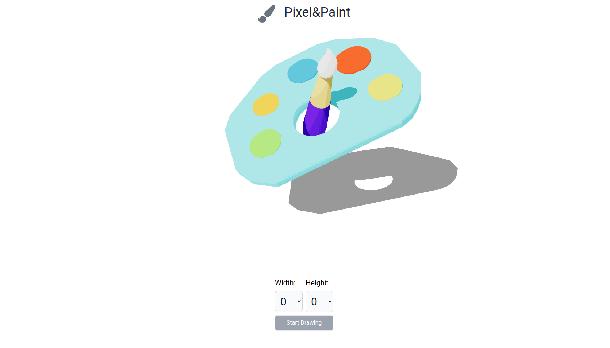

### Project Overview

This project is a pixel painting tool designed for creating 2D images. Users can select their desired grid, paint on it, and then export their work as either a PNG or JPEG image. This project marks my first experience with the Three.js library. Additionally, I created a 3D palette model in Blender for the very first time and positioned it in the hero section.

#### Technologies Used

- Nextjs
- Typescript
- Threejs, react/three-js/fiber, react/three-js/drei
- Framer-motion
- TailwindCSS

[Explore the Source Code](https://github.com/iufb/pixel-paint)

[View the Deployed Site](https://pixel-paint-iufb.vercel.app/)
