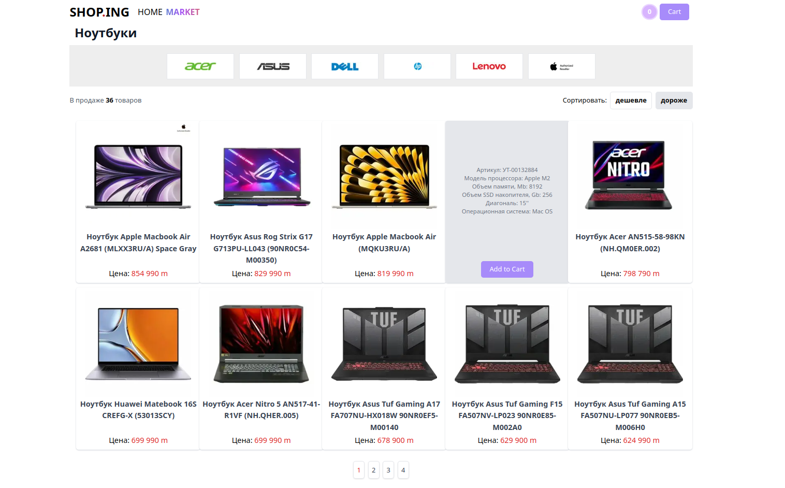
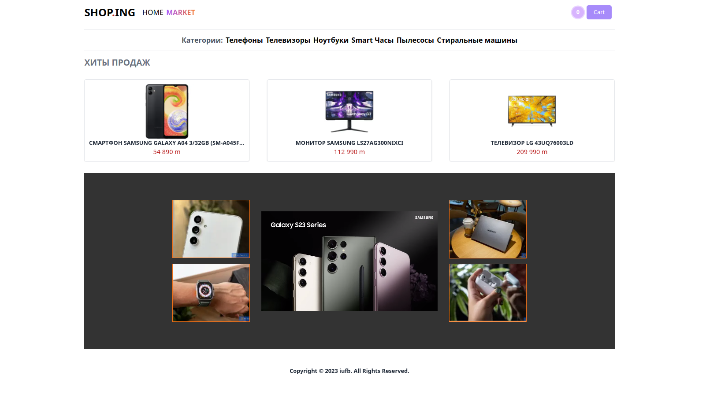

### Project Overview

This project is a web application designed to resemble a shop.
It utilizes a **Python script** as its backend. For the frontend, I opted to use the Next.js framework and Next.js API calls to fetch and display data. To enhance the user experience, I incorporated the Framer Motion library, which provides seamless appearance animations and interactive cursor animations.

#### Technologies Used

- Nextjs
- Typescript
- Python bs4 library for webscrapping
- Framer-motion
- TailwindCSS
- Swiperjs

[Explore the Source Code](https://github.com/iufb/shop.ing)
