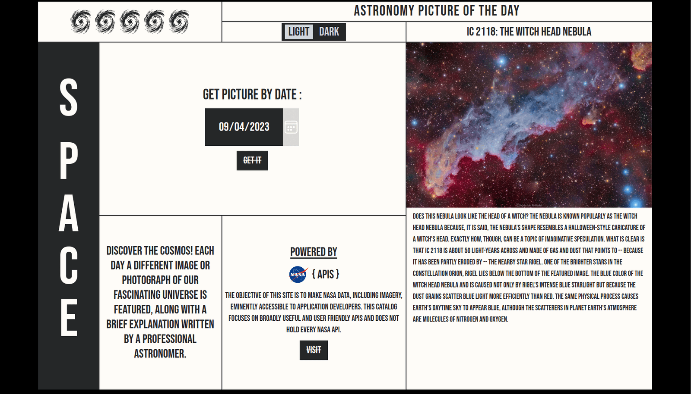

# Astronomy Picture of the Day

This project is shop-like web application that uses python script as back-end.In this case I tried use nextjs framework with nextjs api calles to display data. Using framer-motion library to make great appear animations , change cursor animations.

## Technologies Used

List the technologies, programming languages, and tools you used to build this project.

- Technology 1
- Technology 2
- Technology 3

You can add text, images, links, and more using standard Markdown syntax.

[Github repo](https://github.com/iufb/Astronomy-Picture-of-the-Day)
